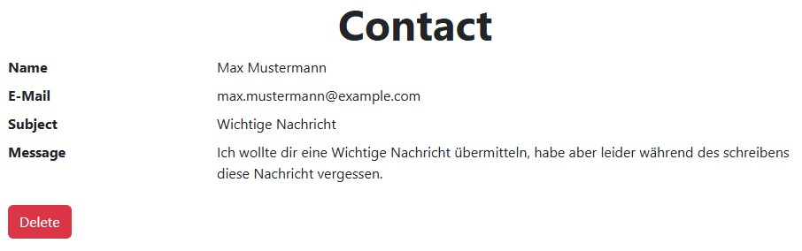

# Löschen

Bisher können Benutzer uns Kontaktanfragen schicken und diese auch wieder ansehen. Jedoch haben sie keine Möglichkeit ihre Kontaktanfragen auch wieder zu löschen.
Das wollen wir in dieser Aufgabe ändern.

## Aufgabe

Erstelle zuerst eine weitere _Route_ `/delete`. Verwende für diese einen Anfragetyp deiner Wahl (`GET` oder `POST`) und lege fest wie die `id` der zu löschenden `ContactRequest` übergeben werden soll.

Lies dann in dieser Funktion die `id` aus und lösche, falls eine Anfrage mit der gegebenen `id` existiert, diese Anfrage.
Sollte die Anfrage nicht existieren, kann erneut das Template `error.html` verwendet werden.

Füge schließlich noch einen Knopf im `view.html` Template hinzu, um mit diesem die `ContactRequest` zu löschen.

Das geänderte `view.html` Template könnte dann in etwa wie im folgenden Bild aussehen.



Denke auch hier daran, dass deine Funktion korrekte [HTTP-Antwortstatuscodes](https://developer.mozilla.org/de/docs/Web/HTTP/Status) verwendet.

## Testen

::: info
Für diese Aufgabe gibt es keine `check50` Überprüfungen, da hier die Ergebnisse sehr individuell ausfallen.
:::

### Style

Leider unterstützt `style50` keine HTML-Dateien. Daher liegt es an dir, deine HTML-Tags sauber einzurücken und auszurichten.
Deine `app.py` Datei kannst du jedoch mit folgendem Befehl überprüfen.

```bash
style50 app.py
```
