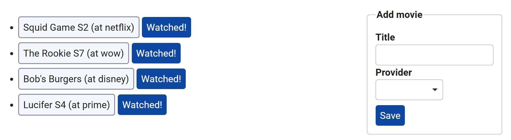

# Verschönerung

Bisher sieht unsere Merkliste noch nicht sonderlich gut aus. Wir verwenden _Times New Roman_ als Schriftart und auch sonst ist die Website eher eintönig.
Verschönere daher die folgenden Elemente der Seite mit CSS. Schreibe hierbei guten CSS Code, welcher auch die _Vererbung von Eigenschaften_ ausnutzt.

Schreibe den gesamten CSS-Code in einer neuen Datei namens `style.css`, welche du schließlich in `index.html` einbindest.

## Aufgabe

::: warning
Verbringe nicht zu viel Zeit damit, das Bild perfekt nachzubauen. Vielmehr geht es darum, die verschiedenen Möglichkeiten, die CSS bietet auszuprobieren und zu sehen.
:::

Im folgenden findest du ein Bild der fertigen, nun mit CSS verschönerten, Website. Versuche soweit möglich, dass deine Website so ähnlich aussieht!
Du musst nicht alles perfekt nachbauen, jedoch sollten die wesentlichen Merkmale sichtbar sein.



::: tip
Es kann möglicherweise auch Sinn machen, die bereits existierende HTML-Struktur zu überdenken und umzubauen.
:::

<details>
    <summary>Welche Farben sind denn auf der Website verwendet?</summary>

-   **Blau:** `#0d47a1`
-   **Hellblauer Hintergrund:** `#f5f7ff`
-   **Rahmenfarbe:** `#898ea4`
-   **Text:** `#212121`
</details>

## Testen

::: info
Für diese Aufgabe gibt es keine `check50` Überprüfungen, da hier die Ergebnisse sehr individuell ausfallen.
:::

### Style

Führe den folgenden Befehl aus, um den Stil deines Codes mit `style50` zu analysieren:

```bash
style50 style.css
```
