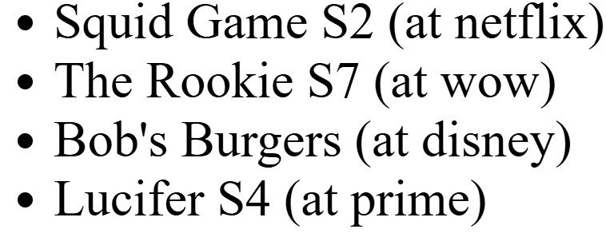

# Merkliste

::: info
Diese Aufgabe basiert auf _keinem CS50 Practice Problem_.

**Disclaimer:** Diese Aufgabe wurde nicht vom Lehrstuhl herausgegeben und kann Fehler enthalten. Sie dient, wie das gesamte Material von [inf-lab.dev](https://inf-lab.dev), lediglich zu Übungszwecken!
:::

Wir alle verwenden verschiedene Streamingdienste um uns Filme oder Serien anzusehen. Die meisten dieser Dienste haben auch eine sogenannte Merkliste. Diese bietet eine Möglichkeit, Filme oder Serien zu markieren, um sie später anzusehen.

Leider hat jede Streamingplattform ihre eigene Merkliste. In dieser Aufgabe möchten wir das ändern, indem wir eine universelle Merkliste als Website programmieren.

## Aufgabenmaterial herunterladen

Um das Aufgabenmeterial herunterzuladen, gib folgenden Befehl in _ein neues Terminal_ in deinem Codespace ein:

```bash
wget -O - https://inf-lab.dev/watchlist/material/lab-watchlist.zip.sh | bash
```

## Teilaufgabe 1

Nachdem du das Aufgabenmaterial heruntergeladen hast, beginne damit, dir die bereitgestellte `index.html` Datei anzusehen.
Beantworte hierzu insbesondere die folgenden Fragen:

1. In welcher Sprache (gemeint ist die _natürliche_ Sprache, _nicht die Programmiersprache_) ist der Inhalt des Dokuments laut seinen Elementen?
2. Wie lautet der Titel des HTML-Dokuments, wenn es im Browser angesehen wird?

## Teilaufgabe 2

Um überhaupt Einträge auf unserer Merkliste speichern zu können, benötigen wir ein Formular um diese hinzuzufügen.
Erstelle daher ein HTML-Formular, welches es uns erlaubt Einträge auf unsere Merkliste hinzuzufügen.

Dieses Formular soll über zwei Eingabefelder verfügen. Erstens ein Feld für den Titel `title` des Films und zweitens eine Auswahlmöglichkeit für die Plattform `provider`, auf der der Film verfügbar ist. Schließlich benötigt unser Formular noch einen Button, um es _abzusenden_ (also zu speichern).

Überlege dir selbst, welche Elemente du sinnvoll für den Titel und die Platform verwenden kannst, und welche Attribute diese Elemente benötigen. Achte auch darauf, dass der Nutzer weiß, wofür welches Feld verwendet werden soll.

Im folgenden Bild ist dargestellt, wie das Formular am Ende aussehen könnte.


<details>
    <summary>Du weißt nicht wie du die Umrandung mit der Beschriftung erstellen sollst?</summary>

Hierzu wurde das `<fieldset>` Element verwendet, weitere Informationen zu diesem Element findest du in den [MDN web docs](https://developer.mozilla.org/de/docs/Web/HTML/Element/fieldset).

</details>

## Teilaufgabe 3

Nachdem wir nun das Formular erstellt haben, ist es an der Zeit den zugehörigen JavaScript Code zu schreiben.

Sobald das Formular abgesendet wurde, soll überprüft werden, ob sowohl `title` als auch `provider` einen validen Wert enthalten. Sollte dies nicht der Fall sein, kannst du einfach mit der [`alert`](https://developer.mozilla.org/de/docs/Web/API/Window/alert) Funktion eine Fehlermeldung ausgeben.

Erstelle eine globale Variable `movies`, in der alle Filme der Merkliste gespeichert werden. Ergänze deinen Code so, dass der Film aus dem Formular nach erfolgreicher Validierung zur Merkliste hinzugefügt wird. Sorge außerdem dafür, dass das Formular nach dem Hinzufügen automatisch zurückgesetzt wird, damit ein weiterer Eintrag bequem eingefügt werden kann.

::: info
Natürlich macht es in der Praxis wenig Sinn Formulardaten nur in einer JavaScript Liste zu speichern, da diese mit jedem Neuladen der Seite wieder _gelöscht_ wird.
Für die Zwecke dieser Übung ist das allerdings vollkommen ausreichend!

Solltest du deine Einträge jedoch beibehalten wollen, wenn du die Seite neu lädst, findest du unter [Einträge dauerhaft speichern](#einträge-dauerhaft-speichern) einige Hinweise.
:::

<details>
    <summary>Du bist dir nicht sicher wie du sowohl den Titel als auch die Platform in einer Liste speichern kannst?</summary>

Um mehrere Elemente an einer Stelle zu speichern, haben wir in C `stuct`s verwendet, in Python `dict`s. In JavaScript existieren _Objekte_ als ein ähnliches Konzept.
Um beispielsweise eine Person mit Vor- und Nachnamen darzustellen, kann folgender Code verwendet werden.

<!-- prettier-ignore -->
```js
person = {
    'firstName': 'Max',
    'lastName': 'Mustermann',
}
```

</details>

## Teilaufgabe 4

Da wir nun Filme auf unsere Merkliste setzen können, sollten wir diese auch anzeigen.

Erstelle hierzu im HTML-Code eine unsortierte Liste und befülle diese in einer neuen JavaScript Funktion namens `render`.
Zuerst sollte diese Funktion alle bereits bestehenden Listenelemente löschen, sodass wir sie mehrmals hintereinander aufrufen können ohne Einträge doppelt auszugeben.
Iteriere dann in dieser Funktion über alle `movies` und erstelle für jeden Eintrag ein neues Listenelement gemäß dem Format `<title> (at <provider>)`, wobei `<title>` und `<provider>` natürlich durch die jeweiligen Daten ersetzt werden sollen.
Füge schließlich die erstellen Listenelemente in die Liste ein.

Ändere nun deinen Code aus [Teilaufgabe 3](#teilaufgabe-3) so ab, dass dieser nach erfolgreichem Einfügen in die `movies` Liste auch die Funktion `render` aufruft um die Liste darzustellen.

Wenn du alles richtig gemacht hast, könnte deine fertige Liste (je nach Eingaben im Formular) wie im folgenden Bild aussehen.



<details>
    <summary>Du bist dir nicht sicher, wie du in JavaScript neue HTML-Elemente erstellen kannst?</summary>

Um in JavaScript HTML-Elemente _zu erstellen_ kann die Funktion `document.createElement(tagName)` verwendet werden. Weitere Informationen zu dieser Funktion findest du in den [mdn web docs](https://developer.mozilla.org/de/docs/Web/API/Document/createElement).

**Wichtig:** Vergiss nicht, dein erstelltes Element auch irgendwo einzufügen, sonst wird es nur erstellt, aber nirgens angezeigt!

</details>

## Teilaufgabe 5

Nun können wir Filme auf unsere Liste einfügen und diese auch ansehen. Jetzt fehlt nur noch eine Funktion bereits angesehene Filme auch wieder zu löschen.

Passe den Code der `render`-Funktion so an, dass für jeden Eintrag neben dem Text zusätzlich ein `<button>` mit dem Text `Watched!` erstellt wird. Beim Anklicken dieses Buttons soll das entsprechende Element aus der Liste gelöscht werden.
Vergiss nicht, nach dem Löschen auch wieder deine `render` Funktion aufzurufen, sonst wirst du vom Löschen nichts sehen!

Das könnte dann wie im folgenden Bild aussehen.


<details>
    <summary>Du bist dir nicht sicher, wie du in JavaScript einen Eintrag aus einer Liste löschen kannst?</summary>

Hierfür gibt es in JavaScript mehrere Möglichkeiten. Weit verbreitet ist jedoch die Verwendung von [`splice(start, deleteCount)`](https://developer.mozilla.org/de/docs/Web/JavaScript/Reference/Global_Objects/Array/splice). Ein Beispiel, um das Obst `Apfel` aus der Liste zu entfernen, kann folgenden Code entnommen werden.

```js
let fruit = ['Banane', 'Apfel', 'Melone'];

fruit.splice(1, 1);
```

**Wichtig:** Achte darauf, dass `deleteCount` (der zweite Parameter) immer `1` ist, da sonst mehr als ein Element entfernt wird.

</details>

## Testen

Starte `http-server` in einem Terminal, während du dich im Verzeichnis `lab-watchlist` befindest, um einen Webserver zu starten, der die Webseite bereitstellt.

### Einträge dauerhaft speichern

Bisher ist es so, dass die `movies` bei jedem Laden der Website wieder _vergessen_ wurden. Für unser Testen kann es jedoch hilfreich sein, wenn diese dauerhaft gespeichert werden.

Hierfür haben wir etwas Code vorbereitet, den du nicht verstehen musst.[^1] Füge einfach folgenden HTML-Code **vor deinem eigenen `<script>` Element** ein und kommentiere das erstellen deiner `movies` Variable aus. Diese wird dir von unserem Code erstellt.

Nun sollte deine `movies`-Liste solange gespeichert bleiben, bis du die Website wirklich schließt.

```html
<script src="https://inf-lab.dev/watchlist/material/persistent-movies.hosted.js"></script>
```

Vergiss nicht, die `movies` Variable wieder normal zu erstellen, wenn du das Skript entfernst!

[^1]: _Nur für interessierte:_ Der Code verwendet die [`sessionStorage`](https://developer.mozilla.org/de/docs/Web/API/Window/sessionStorage) Schnittstelle des Browsers um die Daten temporär zu speichern.

### Korrektheit

Für diese Aufgabe gibt es kein `check50`, da die Implementierungen sehr unterschiedlich ausfallen können.

### Style

Leider unterstützt `style50` keine HTML-Dateien. Daher liegt es an dir, deine HTML-Tags sauber einzurücken und auszurichten.
